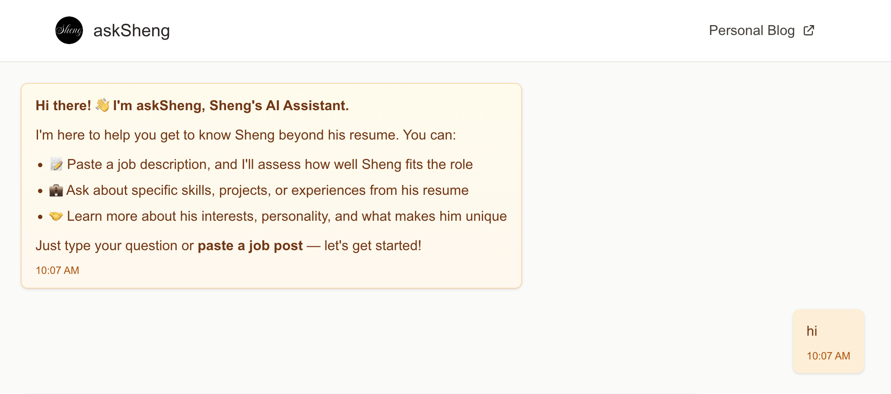

# askSheng

An AI assistant built to help answer questions from recruiters and hiring managers — about me.

The idea is simple: instead of me doing all the talking about what I'm good at…
why not let an AI do the bragging for me? 😎

## What is askSheng?
At a high level, askSheng is a chat interface powered by an OpenAI language model. It allows users to interact with an AI agent that knows about my professional experience, skills, and projects.
When a job description is provided, the AI evaluates my fit for the role:
- If it's a good fit, it explains why — highlighting relevant skills and past work.
- If it's not, it provides reasons for the mismatch.
But behind the scenes, there’s more going on — including access control, prompt engineering, and session management.

## Tech stacks
- Next.js
- Postgres
- Docker compose (for local development)
